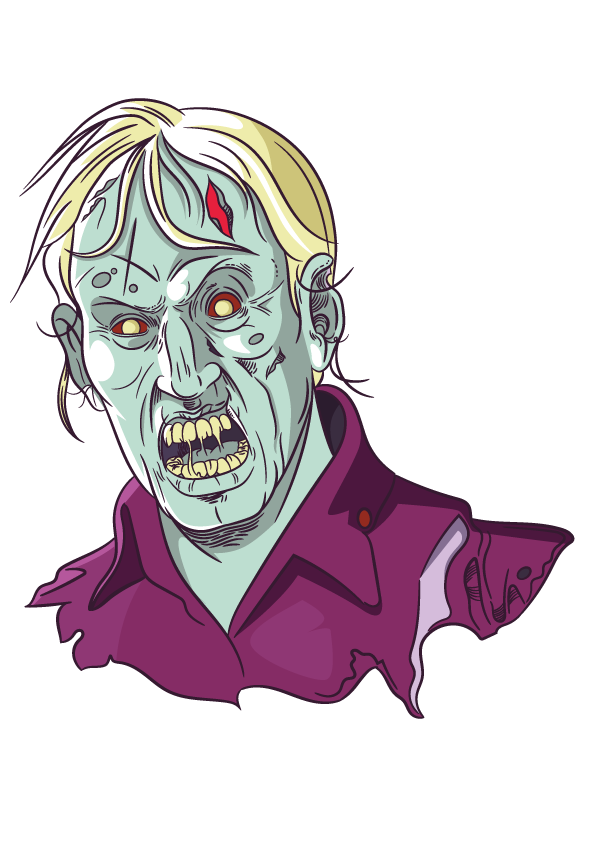

<h2 align="center">
   
  Tela de Login Lost Age Survival
</h2>
  

    
  

   
  
  ### :computer: Linguagens e Tecnologias usadas para recriar a interface:
  Abaixo estão os links de tudo que foi usado: 
    - [Figma](https://www.figma.com/) para recriar a UI.  
    - [JQuery](https://jquery.com/)

  ### 🎮 Projeto
  Uma simples tela de Login feita para os usuários realizarem o Login em nosso servidor.

### :recycle: Como contribuir

- Fork esse repositório;
- Crie uma branch com a sua feature: `git checkout -b my-feature`
- Commit suas mudanças: `git commit -m 'feat: My new feature'`
- Push a sua branch: `git push origin my-feature`

### :memo: Licença

Esse projeto está sob a licença MIT. Veja o arquivo [LICENSE](LICENSE.md) para mais detalhes.

### :muscle: Quem deu aquela força para não desistir?

O pessoal da He4rt Developers e da Rocketseat deram aquela mão quando as coisas ficaram ruins e me salvaram, sem me deixar desistir!
Entrem na [comunidade da He4rt Developers](https://discord.gg/8mA4CM2) e [na comunidade da Rocketseat :rocket:](https://discordapp.com/invite/gCRAFhc)

---
Feito com ❤️ by João Carli :wave: